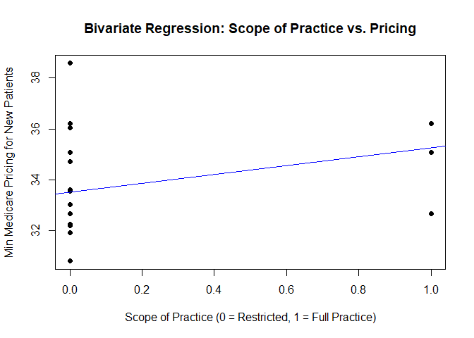

Bivariate Linear Regression Analysis on Scope of Practice and Mode Copay
for New Patients
================

# 

``` r
install.packages("readxl", repos = "https://cran.rstudio.com/")
```

    ## Installing package into 'C:/Users/brean/AppData/Local/R/win-library/4.3'
    ## (as 'lib' is unspecified)

    ## package 'readxl' successfully unpacked and MD5 sums checked
    ## 
    ## The downloaded binary packages are in
    ##  C:\Users\brean\AppData\Local\Temp\RtmpEXZ4Ty\downloaded_packages

``` r
library(readxl)
```

    ## Warning: package 'readxl' was built under R version 4.3.3

``` r
df <- read_excel("C:/Users/brean/OneDrive/Documents/PhD/Data/Bivariate anaylsis.xlsx", sheet = 1)
```

## Variables

- **Dependent Variable (DV):** `mode_copay_for_new_patient`
- **Independent Variable (IV):** `Scope of Practice`

``` r
# Convert Scope of Practice into a binary variable
df$scope_binary <- ifelse(df$`Scope of Practice` == "Full Independent Practice Authority", 1, 0)

table(df$scope_binary)
```

    ## 
    ##    0    1 
    ## 2586  378

``` r
# Dependent variable

df$DV <- df$mode_copay_for_new_patient

options(repos = c(CRAN = "https://cran.rstudio.com/"))

install.packages("rstanarm", dependencies = TRUE)
```

    ## Installing package into 'C:/Users/brean/AppData/Local/R/win-library/4.3'
    ## (as 'lib' is unspecified)

    ## package 'rstanarm' successfully unpacked and MD5 sums checked

    ## Warning: cannot remove prior installation of package 'rstanarm'

    ## Warning in file.copy(savedcopy, lib, recursive = TRUE): problem copying
    ## C:\Users\brean\AppData\Local\R\win-library\4.3\00LOCK\rstanarm\libs\x64\rstanarm.dll
    ## to
    ## C:\Users\brean\AppData\Local\R\win-library\4.3\rstanarm\libs\x64\rstanarm.dll:
    ## Permission denied

    ## Warning: restored 'rstanarm'

    ## 
    ## The downloaded binary packages are in
    ##  C:\Users\brean\AppData\Local\Temp\RtmpEXZ4Ty\downloaded_packages

``` r
install.packages("rstanarm", dependencies = TRUE)
```

    ## Installing package into 'C:/Users/brean/AppData/Local/R/win-library/4.3'
    ## (as 'lib' is unspecified)

    ## package 'rstanarm' successfully unpacked and MD5 sums checked

    ## Warning: cannot remove prior installation of package 'rstanarm'

    ## Warning in file.copy(savedcopy, lib, recursive = TRUE): problem copying
    ## C:\Users\brean\AppData\Local\R\win-library\4.3\00LOCK\rstanarm\libs\x64\rstanarm.dll
    ## to
    ## C:\Users\brean\AppData\Local\R\win-library\4.3\rstanarm\libs\x64\rstanarm.dll:
    ## Permission denied

    ## Warning: restored 'rstanarm'

    ## 
    ## The downloaded binary packages are in
    ##  C:\Users\brean\AppData\Local\Temp\RtmpEXZ4Ty\downloaded_packages

``` r
library(rstanarm)
```

    ## Warning: package 'rstanarm' was built under R version 4.3.3

    ## Loading required package: Rcpp

    ## This is rstanarm version 2.32.1

    ## - See https://mc-stan.org/rstanarm/articles/priors for changes to default priors!

    ## - Default priors may change, so it's safest to specify priors, even if equivalent to the defaults.

    ## - For execution on a local, multicore CPU with excess RAM we recommend calling

    ##   options(mc.cores = parallel::detectCores())

``` r
# Bayesian linear regression
model <- stan_glm(DV ~ scope_binary, data = df, family = gaussian())
```

    ## 
    ## SAMPLING FOR MODEL 'continuous' NOW (CHAIN 1).
    ## Chain 1: 
    ## Chain 1: Gradient evaluation took 6.7e-05 seconds
    ## Chain 1: 1000 transitions using 10 leapfrog steps per transition would take 0.67 seconds.
    ## Chain 1: Adjust your expectations accordingly!
    ## Chain 1: 
    ## Chain 1: 
    ## Chain 1: Iteration:    1 / 2000 [  0%]  (Warmup)
    ## Chain 1: Iteration:  200 / 2000 [ 10%]  (Warmup)
    ## Chain 1: Iteration:  400 / 2000 [ 20%]  (Warmup)
    ## Chain 1: Iteration:  600 / 2000 [ 30%]  (Warmup)
    ## Chain 1: Iteration:  800 / 2000 [ 40%]  (Warmup)
    ## Chain 1: Iteration: 1000 / 2000 [ 50%]  (Warmup)
    ## Chain 1: Iteration: 1001 / 2000 [ 50%]  (Sampling)
    ## Chain 1: Iteration: 1200 / 2000 [ 60%]  (Sampling)
    ## Chain 1: Iteration: 1400 / 2000 [ 70%]  (Sampling)
    ## Chain 1: Iteration: 1600 / 2000 [ 80%]  (Sampling)
    ## Chain 1: Iteration: 1800 / 2000 [ 90%]  (Sampling)
    ## Chain 1: Iteration: 2000 / 2000 [100%]  (Sampling)
    ## Chain 1: 
    ## Chain 1:  Elapsed Time: 0.053 seconds (Warm-up)
    ## Chain 1:                0.261 seconds (Sampling)
    ## Chain 1:                0.314 seconds (Total)
    ## Chain 1: 
    ## 
    ## SAMPLING FOR MODEL 'continuous' NOW (CHAIN 2).
    ## Chain 2: 
    ## Chain 2: Gradient evaluation took 2.3e-05 seconds
    ## Chain 2: 1000 transitions using 10 leapfrog steps per transition would take 0.23 seconds.
    ## Chain 2: Adjust your expectations accordingly!
    ## Chain 2: 
    ## Chain 2: 
    ## Chain 2: Iteration:    1 / 2000 [  0%]  (Warmup)
    ## Chain 2: Iteration:  200 / 2000 [ 10%]  (Warmup)
    ## Chain 2: Iteration:  400 / 2000 [ 20%]  (Warmup)
    ## Chain 2: Iteration:  600 / 2000 [ 30%]  (Warmup)
    ## Chain 2: Iteration:  800 / 2000 [ 40%]  (Warmup)
    ## Chain 2: Iteration: 1000 / 2000 [ 50%]  (Warmup)
    ## Chain 2: Iteration: 1001 / 2000 [ 50%]  (Sampling)
    ## Chain 2: Iteration: 1200 / 2000 [ 60%]  (Sampling)
    ## Chain 2: Iteration: 1400 / 2000 [ 70%]  (Sampling)
    ## Chain 2: Iteration: 1600 / 2000 [ 80%]  (Sampling)
    ## Chain 2: Iteration: 1800 / 2000 [ 90%]  (Sampling)
    ## Chain 2: Iteration: 2000 / 2000 [100%]  (Sampling)
    ## Chain 2: 
    ## Chain 2:  Elapsed Time: 0.048 seconds (Warm-up)
    ## Chain 2:                0.27 seconds (Sampling)
    ## Chain 2:                0.318 seconds (Total)
    ## Chain 2: 
    ## 
    ## SAMPLING FOR MODEL 'continuous' NOW (CHAIN 3).
    ## Chain 3: 
    ## Chain 3: Gradient evaluation took 1.5e-05 seconds
    ## Chain 3: 1000 transitions using 10 leapfrog steps per transition would take 0.15 seconds.
    ## Chain 3: Adjust your expectations accordingly!
    ## Chain 3: 
    ## Chain 3: 
    ## Chain 3: Iteration:    1 / 2000 [  0%]  (Warmup)
    ## Chain 3: Iteration:  200 / 2000 [ 10%]  (Warmup)
    ## Chain 3: Iteration:  400 / 2000 [ 20%]  (Warmup)
    ## Chain 3: Iteration:  600 / 2000 [ 30%]  (Warmup)
    ## Chain 3: Iteration:  800 / 2000 [ 40%]  (Warmup)
    ## Chain 3: Iteration: 1000 / 2000 [ 50%]  (Warmup)
    ## Chain 3: Iteration: 1001 / 2000 [ 50%]  (Sampling)
    ## Chain 3: Iteration: 1200 / 2000 [ 60%]  (Sampling)
    ## Chain 3: Iteration: 1400 / 2000 [ 70%]  (Sampling)
    ## Chain 3: Iteration: 1600 / 2000 [ 80%]  (Sampling)
    ## Chain 3: Iteration: 1800 / 2000 [ 90%]  (Sampling)
    ## Chain 3: Iteration: 2000 / 2000 [100%]  (Sampling)
    ## Chain 3: 
    ## Chain 3:  Elapsed Time: 0.08 seconds (Warm-up)
    ## Chain 3:                0.257 seconds (Sampling)
    ## Chain 3:                0.337 seconds (Total)
    ## Chain 3: 
    ## 
    ## SAMPLING FOR MODEL 'continuous' NOW (CHAIN 4).
    ## Chain 4: 
    ## Chain 4: Gradient evaluation took 1.5e-05 seconds
    ## Chain 4: 1000 transitions using 10 leapfrog steps per transition would take 0.15 seconds.
    ## Chain 4: Adjust your expectations accordingly!
    ## Chain 4: 
    ## Chain 4: 
    ## Chain 4: Iteration:    1 / 2000 [  0%]  (Warmup)
    ## Chain 4: Iteration:  200 / 2000 [ 10%]  (Warmup)
    ## Chain 4: Iteration:  400 / 2000 [ 20%]  (Warmup)
    ## Chain 4: Iteration:  600 / 2000 [ 30%]  (Warmup)
    ## Chain 4: Iteration:  800 / 2000 [ 40%]  (Warmup)
    ## Chain 4: Iteration: 1000 / 2000 [ 50%]  (Warmup)
    ## Chain 4: Iteration: 1001 / 2000 [ 50%]  (Sampling)
    ## Chain 4: Iteration: 1200 / 2000 [ 60%]  (Sampling)
    ## Chain 4: Iteration: 1400 / 2000 [ 70%]  (Sampling)
    ## Chain 4: Iteration: 1600 / 2000 [ 80%]  (Sampling)
    ## Chain 4: Iteration: 1800 / 2000 [ 90%]  (Sampling)
    ## Chain 4: Iteration: 2000 / 2000 [100%]  (Sampling)
    ## Chain 4: 
    ## Chain 4:  Elapsed Time: 0.06 seconds (Warm-up)
    ## Chain 4:                0.249 seconds (Sampling)
    ## Chain 4:                0.309 seconds (Total)
    ## Chain 4:

``` r
# Summary
summary(model)
```

    ## 
    ## Model Info:
    ##  function:     stan_glm
    ##  family:       gaussian [identity]
    ##  formula:      DV ~ scope_binary
    ##  algorithm:    sampling
    ##  sample:       4000 (posterior sample size)
    ##  priors:       see help('prior_summary')
    ##  observations: 2964
    ##  predictors:   2
    ## 
    ## Estimates:
    ##                mean   sd   10%   50%   90%
    ## (Intercept)  33.5    0.0 33.5  33.5  33.6 
    ## scope_binary  1.7    0.1  1.6   1.7   1.9 
    ## sigma         1.7    0.0  1.7   1.7   1.8 
    ## 
    ## Fit Diagnostics:
    ##            mean   sd   10%   50%   90%
    ## mean_PPD 33.7    0.0 33.7  33.7  33.8 
    ## 
    ## The mean_ppd is the sample average posterior predictive distribution of the outcome variable (for details see help('summary.stanreg')).
    ## 
    ## MCMC diagnostics
    ##               mcse Rhat n_eff
    ## (Intercept)   0.0  1.0  3395 
    ## scope_binary  0.0  1.0  4021 
    ## sigma         0.0  1.0  3617 
    ## mean_PPD      0.0  1.0  3580 
    ## log-posterior 0.0  1.0  2100 
    ## 
    ## For each parameter, mcse is Monte Carlo standard error, n_eff is a crude measure of effective sample size, and Rhat is the potential scale reduction factor on split chains (at convergence Rhat=1).

``` r
plot(df$scope_binary, df$DV,
     xlab = "Scope of Practice (0 = Restricted, 1 = Full Practice)",
     ylab = "Min Medicare Pricing for New Patients",
     main = "Bivariate Regression: Scope of Practice vs. Pricing",
     pch = 16, col = "black")

abline(model, col = "blue")
```

<!-- -->

``` r
coef <- coef(model)
eqn <- paste("y =", round(coef[1], 3), "+", round(coef[2], 3), "* x")
```

The formula DV ~ scope_binary shows that the dependent variable (DV) is
being predicted by the independent variable scope_binary.

Sample Size: 4000 total posterior samples were drawn from the model.

Observations: The dataset has 2964 observations, and the model uses 2
predictors (including the intercept).

Intercept: The average value of DV when the predictor (scope_binary) is
0, with a mean estimate of 33.5.

scope_binary: This predictor has an estimated mean of 1.7, with a small
standard deviation (0.1), indicating a consistent effect across the
samples. sigma: Represents the standard deviation of the residuals
(error term) in the model, which is estimated to be 1.7.

Fit Diagnostics: mean_PPD: This is the mean of the posterior predictive
distribution, which helps in assessing how well the model fits the data.
It is very close to the intercept estimate (33.7).

Conclusion: The model appears to have converged well and the results
show stable and reasonable estimates. It appears that this model
estimates that the predictor scope_binary has a positive effect on the
outcome variable DV.
