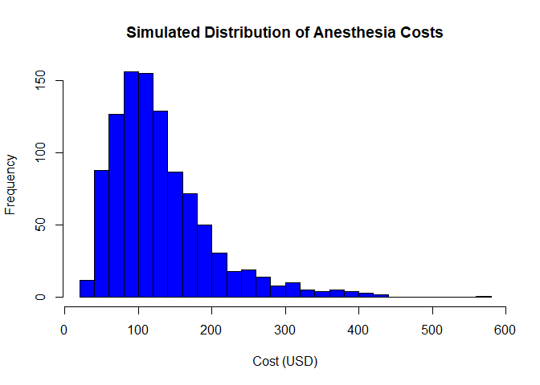
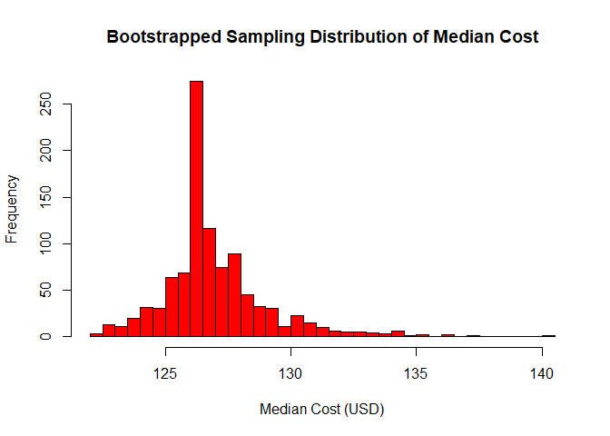
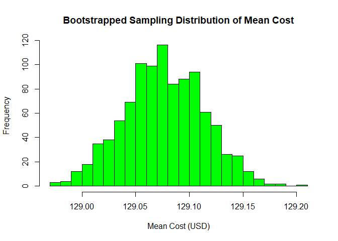

Cost of Anesthesia Services: Conceptual and Operational Definitions
================

## Conceptual Definition

The **cost of anesthesia services** refers to the total charges incurred
for the administration of anesthesia during medical procedures. This
includes fees for the anesthesiologist, anesthesia-related medications,
equipment, and other associated costs. The cost may vary depending on
factors such as procedure complexity, provider type, geographic
location, and insurance reimbursement policies.

## Operational Definition

For this study, the **cost of anesthesia services** is defined as the
Medicare reimbursement rate for anesthesia services per procedure,
measured in U.S. dollars. The operationalization is from Medicare
pricing datasets, where cost is recorded as a continuous variable.

------------------------------------------------------------------------

# Sampling Distributions

``` r
data <- read.csv("~/PhD/Data/2024_pdc_s3_ppl_data_anesthesiology.csv")

# Observed mean and median for new and established patients
mean_cost_new <- mean(data$mode_medicare_pricing_for_new_patient, na.rm = TRUE)
median_cost_new <- median(data$mode_medicare_pricing_for_new_patient, na.rm = TRUE)

mean_cost_established <- mean(data$mode_medicare_pricing_for_established_patient, na.rm = TRUE)
median_cost_established <- median(data$mode_medicare_pricing_for_established_patient, na.rm = TRUE)

cat("Observed Mean Cost (New Patients):", mean_cost_new, "\n")
```

    ## Observed Mean Cost (New Patients): 129.0765

``` r
cat("Observed Median Cost (New Patients):", median_cost_new, "\n")
```

    ## Observed Median Cost (New Patients): 126.4

``` r
cat("Observed Mean Cost (Established Patients):", mean_cost_established, "\n")
```

    ## Observed Mean Cost (Established Patients): 69.98824

``` r
cat("Observed Median Cost (Established Patients):", median_cost_established, "\n")
```

    ## Observed Median Cost (Established Patients): 68.552

``` r
# Simulating Dependent Variable 
set.seed(123)  

n <- 1000
sdlog <- 0.5  
meanlog <- log(mean_cost_new) - (0.5 * sdlog^2)  

simulated_costs <- rlnorm(n, meanlog, sdlog)

# Histogram of simulated costs
hist(simulated_costs, 
     breaks = 30, 
     col = "blue", 
     main = "Simulated Distribution of Anesthesia Costs", 
     xlab = "Cost (USD)", 
     ylab = "Frequency", 
     border = "black")
```

<!-- -->

``` r
# Bootstrapping
costs <- na.omit(data$mode_medicare_pricing_for_new_patient) 

observed_mean <- mean(costs)
observed_median <- median(costs)

cat("Observed Mean:", observed_mean, "\n")
```

    ## Observed Mean: 129.0765

``` r
cat("Observed Median:", observed_median, "\n")
```

    ## Observed Median: 126.4

``` r
set.seed(123)  
n_boot <- 1000 
n <- length(costs)

bootstrap_medians <- replicate(n_boot, median(sample(costs, 10, replace = TRUE)))
bootstrap_means <- replicate(n_boot, mean(sample(costs, n, replace = TRUE)))

# ---- Plots of Sampling Distributions ----

# Histogram of bootstrap medians
hist(bootstrap_medians, 
     breaks = 30, 
     col = "red", 
     main = "Bootstrapped Sampling Distribution of Median Cost", 
     xlab = "Median Cost (USD)", 
     ylab = "Frequency", 
     border = "black")
```

<!-- -->

``` r
# Histogram of bootstrap means
hist(bootstrap_means, 
     breaks = 30, 
     col = "green", 
     main = "Bootstrapped Sampling Distribution of Mean Cost", 
     xlab = "Mean Cost (USD)", 
     ylab = "Frequency", 
     border = "black")
```

<!-- -->

## Summary

1.  **Conceptual and operational definitions** of the dependent
    variable.
2.  **Simulated anesthesia cost data** using a log-normal distribution.
3.  **Observed Values**: -mean_cost_new: 129.08 → Observed mean Medicare
    pricing for new patients. -median_cost_new: 126.4 → Observed median
    Medicare pricing for new patients. -mean_cost_established: 69.99 →
    Observed mean Medicare pricing for established patients.
    -median_cost_established: 68.55 → Observed median Medicare pricing
    for established patients.
4.  **Bootstrapped Values**: -bootstrap_means: A vector of 1000
    bootstrap sample means. -bootstrap_medians: A vector of 1000
    bootstrap sample medians.
5.  **Simulated Values:** -simulated_costs: A vector of 1000 simulated
    anesthesia costs based on a log-normal distribution. -meanlog: 4.735
    → Adjusted log-mean for simulating the log-normal distribution.
    -sdlog: 0.5 → Assumed standard deviation of the log-normal
    distribution.
6.  **Other Information:** -n: 42,966 → Number of non-missing
    observations in your dataset. -n_boot: 1000 → This is the number of
    bootstrap samples used.
