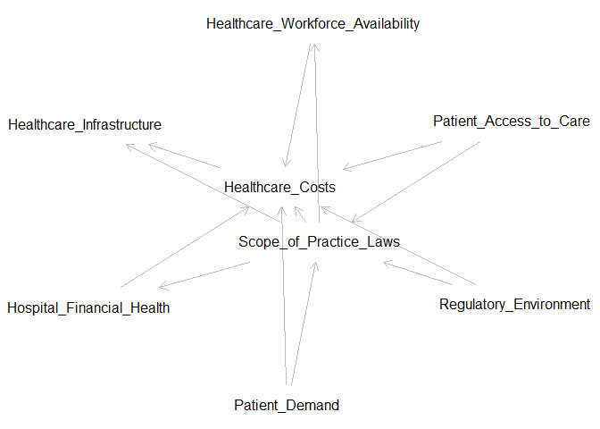

Directed Acyclic Graph (DAG) Analysis: Scope of Practice Laws and
Healthcare Costs
================

**Theorized Population Regression Model**

This model explores the causal relationship between Scope of Practice
Laws (IV) and Healthcare Costs (DV) while accounting for potential
confounders, mediators, and colliders.

Variables in the Model:

- **Independent Variable (IV):** Scope of Practice Laws  
- **Dependent Variable (DV):** Healthcare Costs (continuous: anesthesia
  costs per procedure)  
- **Mediators:** Healthcare Workforce Availability, Hospital Financial
  Health  
- **Confounders:** Patient Access to Care, Regulatory Environment,
  Patient Demand  
- **Collider:** Healthcare Infrastructure

<!-- --> Edges (Causal
Relationships): 1. Scope of Practice Laws → Healthcare Costs 2. Scope of
Practice Laws → Healthcare Workforce Availability → Healthcare Costs 3.
Scope of Practice Laws → Hospital Financial Health → Healthcare Costs 4.
Patient Access to Care → Scope of Practice Laws 5. Patient Access to
Care → Healthcare Costs 6. Regulatory Environment → Scope of Practice
Laws 7. Regulatory Environment → Healthcare Costs 8. Patient Demand →
Scope of Practice Laws 9. Patient Demand → Healthcare Costs 10. Scope of
Practice Laws → Healthcare Infrastructure 11. Healthcare Costs →
Healthcare Infrastructure

**Minimal Adjustment Set** The minimal adjustment set is the smallest
set of variables that must be controlled for to obtain an unbiased
estimate of the causal effect of Scope of Practice Laws on Healthcare
Costs.

Identified Minimal Adjustment Set: • Patient Access to Care (Confounder)
• Regulatory Environment (Confounder) • Patient Demand (Confounder)
**Identification of Colliders, Confounders, and Mediators** •
Confounders: Patient Access to Care, Regulatory Environment, Patient
Demand • Mediators: Healthcare Workforce Availability, Hospital
Financial Health • Collider: Healthcare Infrastructure Colliders should
not be included in the adjustment set, as conditioning on them can
introduce bias.

**Operationalization of Variables** • Scope of Practice Laws:
Legislative measures defining CRNA practice independence (e.g.,
state-level policy data) • Healthcare Costs: Average anesthesia costs
per procedure • Patient Access to Care: Number of patients seen per
APRN, wait times, or geographic distribution of providers • Regulatory
Environment: State policy restrictiveness score • Patient Demand: Number
of patients seeking care per 100,000 population

**Conclusion** This analysis provides a structured approach to
understanding how Scope of Practice Laws influence Healthcare Costs
while accounting for confounders, mediators, and colliders. The minimal
adjustment set ensures unbiased causal inference when estimating the
effect of Scope of Practice Laws on Healthcare Costs.
