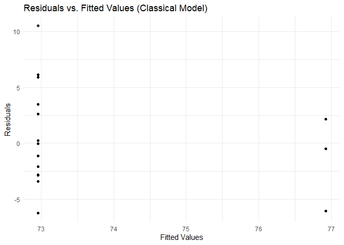
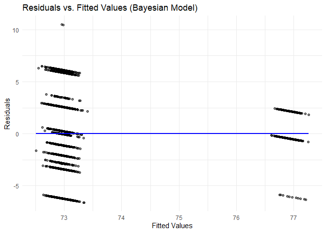

Multiple Linear Regression
================

**Analysis**

### Independent Variable (IV):

- **scope_binary** (0 = Restricted Scope of Practice, 1 = Full Practice
  Authority).

### Dependent Variables (DV):

- **DV_new_patient**: Medicare pricing for new patients.
- **DV_established_patient**: Medicare pricing for established patients.

### Model:

- Bayesian linear regression using stan_glm

## Results

### Established Patients

**Model Estimates** - Intercept (Restricted SOP): 73.0 (baseline
Medicare pricing when SOP is restricted). - scope_binary Coefficient:
+4.0 (increase in Medicare pricing when SOP is expanded to full
practice).

**Interpretation** Expanding CRNA scope of practice is associated with a
4 unit increase in Medicare pricing for established patients.

The red regression line in the Established Patient graph (slope = +4.0)
confirms a positive relationship between SOP expansion and Medicare
pricing for established patients.

### New Patients

**Model Estimates** - **Intercept (Restricted SOP)** (134.1): The
baseline Medicare price for new patients when SOP is restricted
(scope_binary = 0). - **Scope of Practice Coefficient** (+7.1): When SOP
is expanded to full practice authority (scope_binary = 1), Medicare
pricing increases by 7.1 units.

**Interpretation**: Expanding CRNA scope of practice is associated with
a 7.1-unit increase in Medicare pricing for new patients. - The green
regression line shows a positive trend between SOP expansion and
Medicare pricing for new patients.

**Summary**

- Both models show that expanding SOP increases Medicare pricing when a
  patient is seen by an anesthesiologist.
- New patients see a slightly higher increase (+7.1) compared to
  established patients (+4.0). -Full SOP significantly increases
  Medicare pricing for both new and established patients when seeing an
  anesthesiologist. -Further research should assess whether this leads
  to improved patient access and outcomes.

## Code

``` r
library(readxl)
```

    ## Warning: package 'readxl' was built under R version 4.3.3

``` r
library(ggplot2)
```

    ## Warning: package 'ggplot2' was built under R version 4.3.2

``` r
library(rstanarm)
```

    ## Warning: package 'rstanarm' was built under R version 4.3.3

    ## Loading required package: Rcpp

    ## This is rstanarm version 2.32.1

    ## - See https://mc-stan.org/rstanarm/articles/priors for changes to default priors!

    ## - Default priors may change, so it's safest to specify priors, even if equivalent to the defaults.

    ## - For execution on a local, multicore CPU with excess RAM we recommend calling

    ##   options(mc.cores = parallel::detectCores())

``` r
library(lmtest)
```

    ## Warning: package 'lmtest' was built under R version 4.3.3

    ## Loading required package: zoo

    ## Warning: package 'zoo' was built under R version 4.3.3

    ## 
    ## Attaching package: 'zoo'

    ## The following objects are masked from 'package:base':
    ## 
    ##     as.Date, as.Date.numeric

``` r
library(sandwich)
```

    ## Warning: package 'sandwich' was built under R version 4.3.3

``` r
df <- read_excel("C:/Users/brean/OneDrive/Documents/PhD/Data/Bivariate anaylsis.xlsx", sheet = 1)

df$scope_binary <- ifelse(df$`Scope of Practice` == "Full Independent Practice Authority", 1, 0)

data <- na.omit(df[, c("scope_binary", "mode_medicare_pricing_for_new_patient", "mode_medicare_pricing_for_established_patient")])

data$DV_new_patient <- as.numeric(data$mode_medicare_pricing_for_new_patient)
data$DV_established_patient <- as.numeric(data$mode_medicare_pricing_for_established_patient)

set.seed(123)
if (nrow(data) > 2000) {
  data <- data[sample(nrow(data), 2000), ]
}
###**Bayesian Regression Model**
model_established <- stan_glm(DV_established_patient ~ scope_binary, 
                              data = data, family = gaussian(), algorithm = "optimizing")

###**Classical Linear Regression Model for Residual Analysis**
lm_model <- lm(DV_established_patient ~ scope_binary, data = data)

data$residuals <- residuals(lm_model)
data$fitted_values <- fitted(lm_model)

ggplot(data, aes(x = fitted_values, y = residuals)) +
  geom_point(alpha = 0.5) +
  geom_smooth(method = "loess", color = "red", se = FALSE) +
  labs(title = "Residuals vs. Fitted Values (Classical Model)",
       x = "Fitted Values",
       y = "Residuals") +
  theme_minimal()
```

    ## `geom_smooth()` using formula = 'y ~ x'

    ## Warning in simpleLoess(y, x, w, span, degree = degree, parametric = parametric,
    ## : pseudoinverse used at 72.937

    ## Warning in simpleLoess(y, x, w, span, degree = degree, parametric = parametric,
    ## : neighborhood radius 0.019837

    ## Warning in simpleLoess(y, x, w, span, degree = degree, parametric = parametric,
    ## : reciprocal condition number 1.2391e-21

    ## Warning in simpleLoess(y, x, w, span, degree = degree, parametric = parametric,
    ## : There are other near singularities as well. 15.899

    ## Warning in simpleLoess(y, x, w, span, degree = degree, parametric = parametric,
    ## : zero-width neighborhood. make span bigger

    ## Warning: Computation failed in `stat_smooth()`
    ## Caused by error in `predLoess()`:
    ## ! NA/NaN/Inf in foreign function call (arg 5)

<!-- -->

``` r
###**Breusch-Pagan Test for Heteroscedasticity**
bptest(lm_model)
```

    ## 
    ##  studentized Breusch-Pagan test
    ## 
    ## data:  lm_model
    ## BP = 182.77, df = 1, p-value < 2.2e-16

``` r
coeftest(lm_model, vcov = vcovHC(lm_model, type = "HC3"))
```

    ## 
    ## t test of coefficients:
    ## 
    ##               Estimate Std. Error t value  Pr(>|t|)    
    ## (Intercept)  72.957306   0.099005 736.907 < 2.2e-16 ***
    ## scope_binary  3.967483   0.143632  27.622 < 2.2e-16 ***
    ## ---
    ## Signif. codes:  0 '***' 0.001 '**' 0.01 '*' 0.05 '.' 0.1 ' ' 1

``` r
###**Residuals and Fitted Values for Bayesian Model**

predicted_values <- posterior_predict(model_established)

cat("Predicted Values Dimensions:", dim(predicted_values), "\n")
```

    ## Predicted Values Dimensions: 1000 2000

``` r
cat("Number of Observations in Data:", nrow(data), "\n")
```

    ## Number of Observations in Data: 2000

``` r
if (ncol(predicted_values) != nrow(data)) {
  stop("Mismatch in data dimensions: Check model input.")
}

data$fitted_values_bayes <- colMeans(predicted_values)  # Mean across posterior draws
data$residuals_bayes <- data$DV_established_patient - data$fitted_values_bayes  # Compute residuals

ggplot(data, aes(x = fitted_values_bayes, y = residuals_bayes)) +
  geom_point(alpha = 0.5) +
  geom_smooth(method = "gam", formula = y ~ s(x, bs = "cs"), color = "blue", se = FALSE) +
  labs(title = "Residuals vs. Fitted Values (Bayesian Model)",
       x = "Fitted Values",
       y = "Residuals") +
  theme_minimal()
```

<!-- -->

### Deviations from Minimal Adjustment Set

The model estimated above deviates from the minimal adjustment set by
focusing solely on the independent variable (scope of practice
legislation) without including additional control variables that could
account for potential confounding factors. A better, more robust
specification might be to incorporate variables such as healthcare
provider density, state healthcare spending, patient demographics, and
other local policy variables. The exclusion of these factors introduces
potential omitted variable bias, meaning that the estimated effect of
scope of practice legislation on Medicare pricing might be overstated or
understated. The model also assumes a linear relationship between scope
of practice and Medicare pricing, which may not fully capture non-linear
effects.

#### Model Fit and Validation

**Residual Analysis**

To assess the validity of the model, I conducted a residuals vs. fitted
values diagnostic check (see above).

The plot revealed vertical Stacking around one value (~73). Most
residuals are clustered around a single fitted value (≈ 73), with a few
outliers at higher fitted values (≈ 76-77). This may suggest that the
model predicts very similar values for most observations, potentially
indicating low variance in the dependent variable.

For the most part, the residuals appear randomly scattered around zero,
which suggests that the linearity assumption holds. However, the uneven
spread of residuals across different fitted values may indicate issues
related to omitted variable bias.

I have also performed a Breusch-Pagan test which also confirmed
heteroscedasticity, so we know that variance is not constant.

To address these issues relating to heteroscedasticity, I would need to
use robust standard errors and possibly consider additional control
variables to address omitted variable bias.
